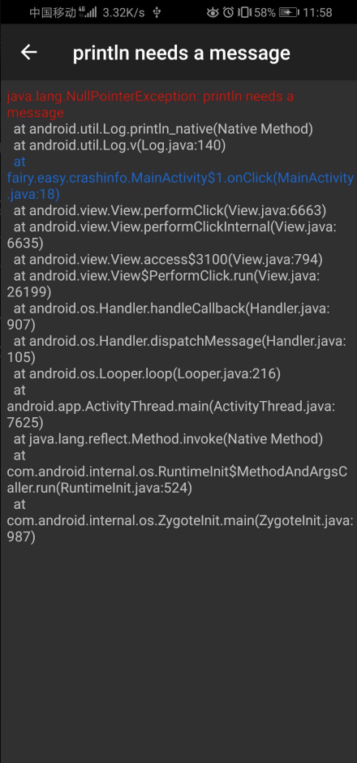

<div align="center">

## CrashCanary

**`Android`Crash日志打印输出**

[ ](https://bintray.com/guxiaonian/crashcanary/crashcanary/_latestVersion)
[](https://github.com/guxiaonian/CrashCanary/issues)
[](https://github.com/guxiaonian/CrashCanary/network)
[](https://github.com/guxiaonian/CrashCanary/stargazers)
[](http://www.apache.org/licenses/LICENSE-2.0)

</div>
<br>

# 效果展示




# 依赖

```gradle
debugImplementation  'fairy.easy.crashcanary:crashcanary:{latestVersion}'
releaseImplementation  'fairy.easy.crashcanary:crashcanary-no-op:{latestVersion}'
//androidX使用
//debugImplementation  'fairy.easy.crashcanary:crashcanary-androidx:{latestVersion}'

```
      
# 调用方式

```java
public class App extends Application {

    @Override
    public void onCreate() {
        super.onCreate();
        CrashCanary.install(this);
    }
}

```
